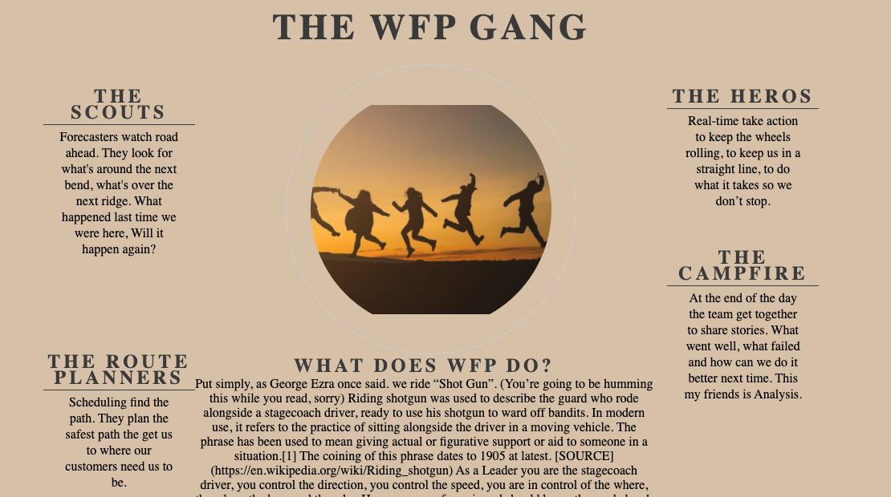

# WFP-Wildwest
Workforce Planning (WFP) has been a profession for over 80 years. However, it si only now becoming a high paying role in Ireland. It is an intimating sector to view form the outside, similar to Full Stack Development. This site introduces potential employees into the sector in an easy to understand and entertaining way. Using the metaphor of the WildWest to explain what each Pillar of the WF Team is responsible for.

Video Responsive Design 

 

### Features
Simple language - as there is no technical or Specialist terms such as Exponential Smoothing, AHT, Adherence or Erlang C used this allows the user to better understand the basic concept of what part Workforce Planning plays in a business.
The Wild West theme - regardless of age every generation has had at least one great wild West movie when growing up. This allows for complex ideas to be illustrated easily and in an entertaining fashion, Ensuring the user does not become overwhelmed and discouraged or bored.
The website is broken down into 5 sections. 
1 - The overview (Home Page)
2 - Forecasting
3 - Scheduling
4 - RTO
5 - Analysis
	
This is how most WFP teams operate. The 3 separate pillars working independently but relying on each other for accurate data & analysis. It allows the user to see how information flows throughout the team and what the impact of poor data and communication can be. 

Forecasting youtube link - This is a short video on Call Center Management. It provides the user with an engaging way to learn more and brings them to a youtube channel with additional resources.
Footer - there are 3 links in the Footer. 

[Linked In](www.linkedin.com/in/davidbarrett233) - access to my Profile so users can reach out to me directly

[Call Centre Helper](https://www.callcentrehelper.com/) - A professional online resource posting articles weekly.

[CCMA](https://www.ccma.ie/) - A professional Irish Education centre for the improvement of Call Centre training, This gives users access to free training material. 

### Existing Features
#### Navigation Bar

Featured on all five pages, the full responsive navigation bar includes links to the Logo, Home page, Forecasting, Scheduling, RTO and Analysis page and is identical in each page to allow for easy navigation.
This section will allow the user to easily navigate from page to page across all devices without having to revert back to the previous page via the ‘back’ button.

#### The landing page image
The landing includes a photograph with text overlay to allow the user to see exactly which location this site would be applicable to.
This section introduces the user to the Players of a Workforce Planning Team  with a subtle animation that grabs attention but leaves the user unsure if they actual saw it. 

#### Team Section
The WFP Gang section introduces the user to the different WFP teams in a fun and interesting manner.
A brief summary of what WFP do is included here so the user is armed with information and context from the start. 

#### The Footer
The footer section includes links to my Linkedin Profile and to relevant training and information specialist websites.  The links will open to a new tab to allow easy navigation for the user.
The footer is valuable to the user as it encourages them to keep to connect with me and to continue their learning if they so wish.

 

#### Forecasting
This page provides a quick paragraph on what the Forecasting team does at a high level.
There is a link to a youtube video expanding more on what Workforce planning is. This needs to be started by the user and can be played as, full screen or in youtube.  

#### Scheduling
This page provides a quick paragraph on what the Scheduling team does at a high level.

#### RTO
This page provides a quick paragraph on what the Forecasting team does at a high level.

#### Analysis
This page provides a quick paragraph on what happens at the end of the day, week, month and year.. How each WFP pillar comes together to share information and context so they can keep improving processes. 

### Features Left to Implement
Interactive Forecasting Tools & Calculators
Scheduling “Build Blocks” generator (Similar to Tetris) adding a gaming aspect would be ideal for the target audience. 

### Testing

#### Validator Testing
##### HTML
Home page
 - 19 errors - when first validated. 
        (- 4 Stray End tag.
        - 3 Unclosed elements.
        - 1 End tag section seen, but there were open elements.
        - 1 The first occurrence of ID center-about was here.
        - 4  Duplicate ID center-about.
        - 4 Empty Headings.
        - 3 The first occurrence of ID.)

Forecasting page
    10 errors - when first validated. 
        (- 1 End tag header seen, but there were open elements.
        - 2 Stray end tag.
        - 1 End tag for body seen, but there were unclosed elements.
        - 1 The frameborder attribute on the iframe element is obsolete. Use CSS instead.
        - 3 Unclosed element section.
        -  2 Section lacks heading. Consider using h2-h6 elements.)

Scheduling Page
    13 Errors -  when first validated. 
        (- 1 End tag header seen, but there were open elements.
        - 4 Unclosed element.
        - 1 Section lacks heading. Consider using h2-h6 elements to.
        - 2 Stray end tag.
        - 1 Duplicate ID.
        - 1 The first occurrence of ID.
        - 1 Empty heading.
        - 1 End tag section seen, but there were open elements.)

RTO Page -
    13 errors - when first validated. As Above.

Analysis Page -
    13 errors - when first validated. As Above.

Testing Summary
58 errors in total after passing through the official W3C validator
These were a result of at least 39 duplicated due to copying a faulty boiler plate to multiple pages. Action taken was to clean up coding and correct error in bracket placement.
Copy & pasting Boiler Plate data prior checking is a clear learning opportunity here for me. 

Once these Errors and Warnings were corrected the HTML code passed successfully with zero erros. 

##### CSS
No errors were found when passing through the official (Jigsaw) validator.

##### Responsivemess in Lighthouse 
For Accessabilty I received 2 different scores 79% and 100% after running the report at different times. 

Both Runs: 

 

 

### Unfixed Bugs -  
Some minor tweaking of alignment values for placement of paragraphs and video. These are a result of inconstent image sizes downloaded from Pexels.com.  

### Deployment
This section should describe the process you went through to deploy the project to a hosting platform (e.g. GitHub)
The site was deployed to GitHub pages. The steps to deploy are as follows:
In the GitHub repository, navigate to the Settings tab
From the source section drop-down menu, select the Master Branch
Once the master branch has been selected, the page will be automatically refreshed with a detailed ribbon display to indicate the successful deployment.
The live link can be found here - 

### https://djbarrett233.github.io/WFP-Wildwest/

### Credits
#### Code
Home page themes structure - Love Running walk through - Coding Institute
Website Design Responsiveness - Coding Institute training videos.

#### Content
Call Centre Helper Logo - [Callcentre Helper](https://www.callcentrehelper.com/)
CCMA Logo - [CCMA](https://www.ccma.ie) 
Linkedin Icon - [Linked In] (https://www.linkedin.com)
The text for Homepage Paragraph - [“A Guide to Call Centre Forecasting”](https://www.callcentrehelper.com/workforce-forecasting-57254.htm) 

All other text content were from presentail notes entitled “Shotgun” written by myself (David Barret) for a presentation to colleges outside of the discipline to explain how we offer support to their business line. - Dec 2020 

#### Media
Images - https://www.pexels.com/

[Forecasting Video](https://www.youtube.com/watch?v=_QKhHfbiMcI&t=1s) 

